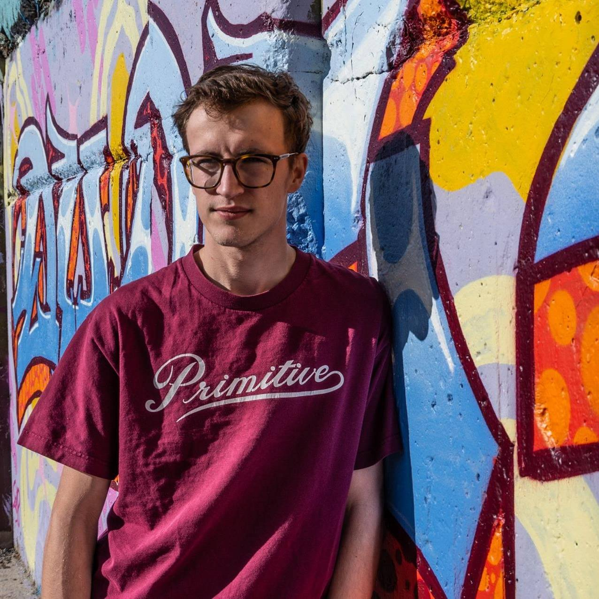
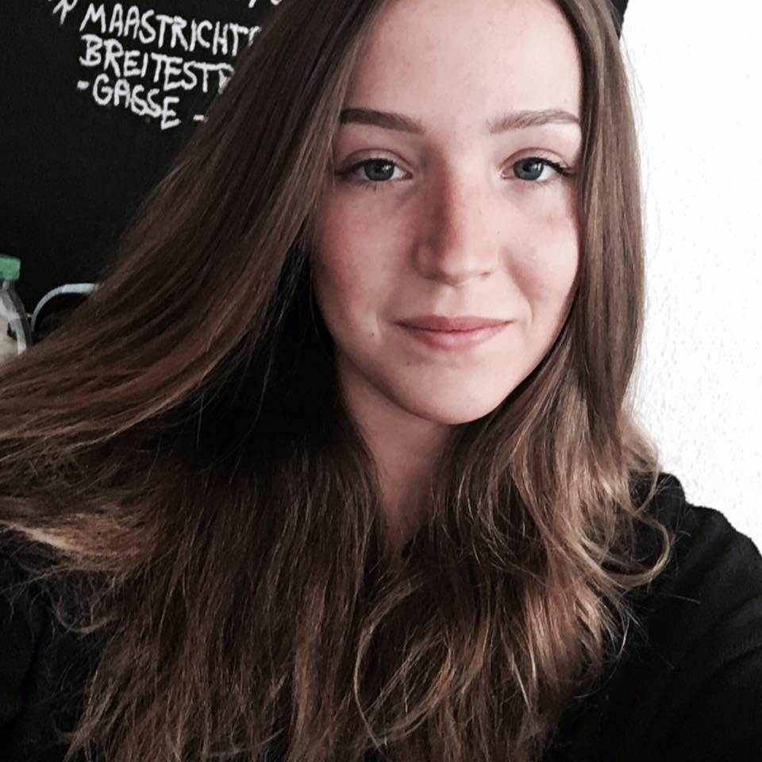
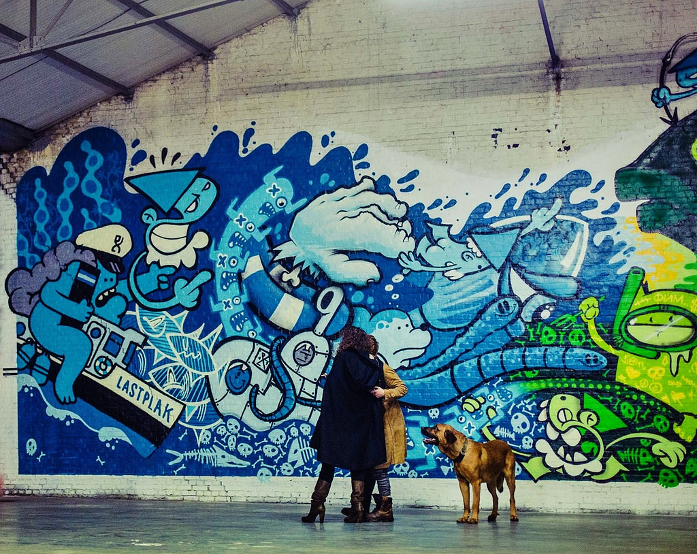
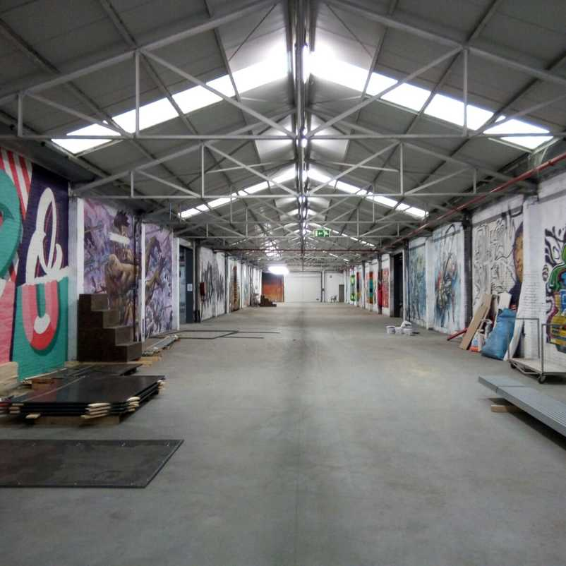

Teamleden
---------

 - Thibaut Dhaenens, 2CMO-GD
 - Steffi Boone, 2CMO-GD

Opdracht
---
Een visuele ervaring creëren voor de museum bezoeker, aan de hand van een smartwatch en smartphone applicatie.

Tags Museum Antwerpen
---

- Een industrieel gebouw met een oppervlakte van 5000m².
- De expositie gaat over 20 Jaar Graffiti & Street-Art in & rond Antwerpen.
- Het museum begeeft zich aan de dokken van antwerpen.
- 40 Artiesten van Rond & In Antwerpen (4 uit Gent).
- Naast het museum kan je er ook: 
  * Evenementen bezoeken.
  * Genieten van de vele foodtrucks.
  * Op zoek gaan naar de nieuwste trends in de modewereld.

