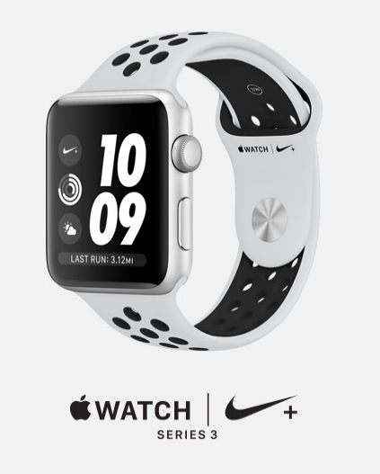
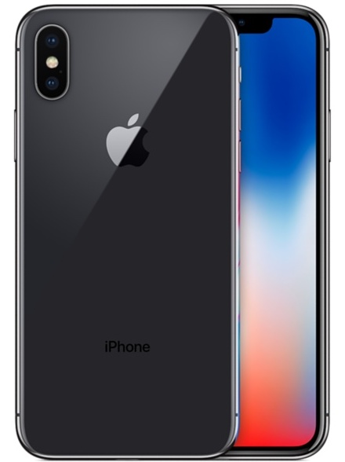

<h2 class="row col-12">Smartwatch Apple Series</h2>

<ul>
<li>Waterbestendigheid tot 50m.De smartwatch is dus geschikt voor duiken in ondiep water en zwemmen.</li>

<li>Mogelijkheid om snel berichten te lezen via een bewegingssensor. Je hoeft slechts je arm op te tillen, en het scherm zal oplichten en het bericht vertonen op de display.</li>

<li>Bediening van het apparaat via touchscreen. Enkel aanpassingen van geluid en klok gebeuren via 2 eenvoudige knoppen aan de zijkant van het apparaat.</li>

</ul>

<ul>
<li>Mogelijkheid tot gebruik van een draadloze koptelefoon of airpods.</li>
<li>Wifi (802.11b/g/n 2,4 GHz).</li>
<li>Bluetooth.</li>
<li>Oled Retina-display met Force Touch. </li>
<li>Display bestaande uit saffier kristallen.</li>
<li>Kast bestaande uit roestvrij staal en keramiek.</li>
<li>Ion-X-glas.</li>
<li>312 x 390 pixels (42 mm)?</li>
<li>Dual-core processor.</li>
<li>Hartslagmeter.</li>
<li>Ingebouwde GPS.</li>
<li>Voice-command via de app 'Siri'.</li>
</ul>

<h2 class="row col-12">Apple Iphone X</h2>

<ul>
<li>Voorzien van een nabijheidsensor.</li>
<li>Gyroscoop met 3 assen.</li>
<li>Versnellingsmeter.</li>
<li>Barometer.</li>
<li>Super Retina HD-display.</li>
<li>5,8‑inch all‑screen OLED-display met Multi‑Touch. </li>
<li>HDR-display met resolutie van 2436 x 1125 pixels bij 458 ppi.</li>
<li>Contrast­verhouding 1.000.000:1.</li>
</ul>

<ul>
<li>True Tone-weergave. </li>
<li>3D Touch.</li>
<li>Max. helderheid van 625 cd/m2.</li>
<li>Vingerafdruk­bestendige, vetafstotende coating. </li>
<li>Ondersteuning gelijktijdige weergave van meerdere talen en tekensets. </li>
<li>Facial Recognition (Face ID).</li>
<li>Spat/water/stof-bestendig.</li>
<li>A11 Bionic-chip met 64‑bits architectuur</li>
</ul>

