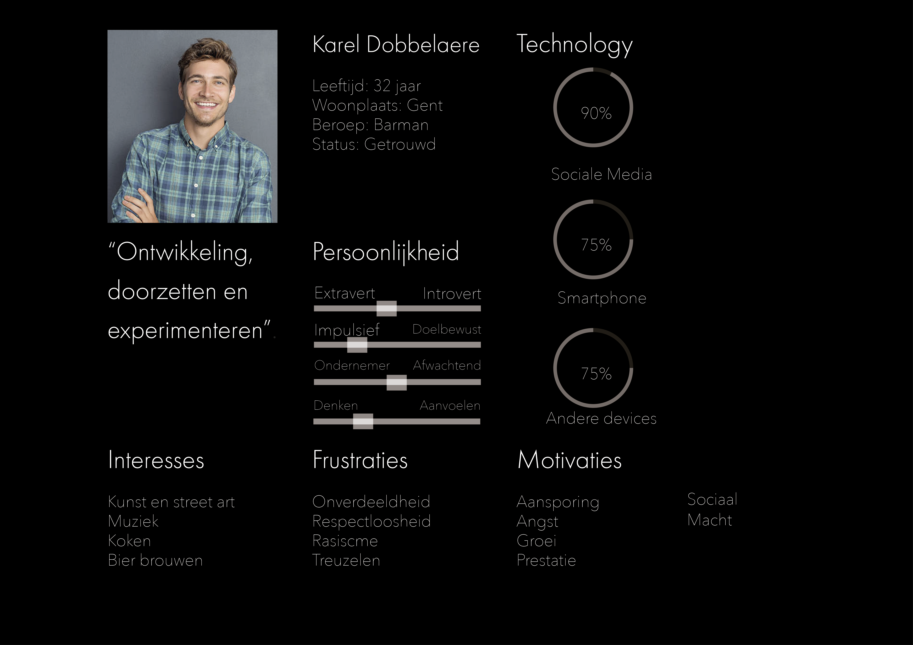
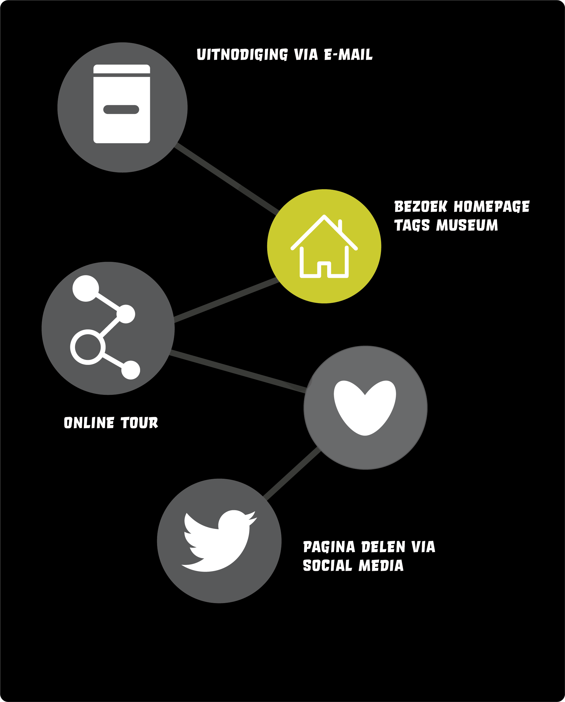
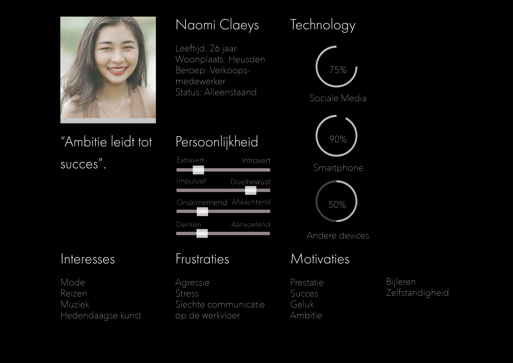

<h2>Journey Map 1</h2>

Karel is barman van beroep. Hij is getrouwd en heeft vorig jaar zijn 1ste kindje gekregen.
Karel is een levensgenieter. Naast barman is Karel ook bezig met het brouwen van zijn eigen bier. Hij heeft een amateurstel aangekocht via 2dehands.be en is zo gestart met zijn hobby. Karel is niet uit op rijkdom. Hij wil de wereld, zichzelf, zijn talenten & interesses verkennen.Samen met zijn vrouw woont hij in een appartement in Centrum-Gent. Karel tekent veel in zijn vrije tijd en is bezig met kunst, zelf zou hij er graag een stuk beter in worden dus experimenteert hij met tal van tools, waaronder stiften, verf, kleurpotloden, bister, & graffiti. Zelf kan Karel niet zo goed omgaan met een spuitbus. Dus oefent hij met Stencils die hij uitsnijd & vervolgens spuit op een muur.

Karel kwam via een vriend te weten over de Tags app. Deze heeft hij geïnstalleerd en zo kwam hij te weten over een nieuw museum in een verlaten industriegebouw in het hartje van Antwerpen. Na even door de app te scrollen beslist Karel een ticket voor het Tags museum te kopen. Hij ontdekt dat je voor het uitchecken de optie krijgt om er treintickets bij te bestellen. Karel vindt dit geweldig aangezien hij niet graag aanschuift in de rij. Karel betaalt de Tickets  Treinticket via deze app. Karel vertrekt vanuit Gent en al meteen ondervind hij hinder met de bus en mist hij de trein die hij wou nemen. Gelukkig is hij in het bezit van een dagticket en verloopt zijn vervoerbewijs niet.

Na een reis van 1u10 minuten komt Karel aan in Antwerpen Centraal. Hij opent Google maps en wandelt tot aan de locatie, dit is een lange wandeling van 25 minuten waar hij door het Antwerpse landschap loopt. Dit vind hij leuk aangezien dat het alweer enkele maanden geleden was dat hij daar geweest is. Onderweg ontdekt hij een nieuw parkje waarbij hij denkt,”Deze plek ga ik onthouden voor een volgende keer”.

Eenmaal aangekomen aan het museum is hij verbaasd door hoe groot het gebouw is. Hij stapt binnen en wordt overweldigd door de industriële uitstraling van het gebouw. Op de vloer zijn lijnen getrokken waardoor je een traject hebt om te volgen.

Hij opent de 'Tags App' en begint de rondleiding. Karel is overweldigd door het eerste werk dat hij tegemoet komt. Een 22m brede muur door de 'Lf-crew'. Karel wil direct meer te weten komen over de leden, en vraagt meer informatie aan op de app. Daar ziet hij welke crewleden hebben meegeholpen aan de muur en welk kleurenpallet hiervoor gebruikt werd. Verder ziet hij nog een stopmotion filmpje hoe de muur is opgebouwd.Na even verder te stappen komt Karel een muur tegen van de Gentse kunstenaar Cee pill. Karel heeft al vaak werken van deze kunstenaar tegengekomen in Gent maar weet niet wie dit is. Via de Tags app komt hij te weten Wie de man is en kan hij doorklikken naar de Instagrampagina & Facebookpagina van Cee Pill. Karel begint Cee Pill te volgen op Instagram, dit vind hij leuk want hij was al een tijdje op zoek naar het profiel van de desbetreffende kunstenaar. 

Op het einde van rondleiding komt hij de muur van Aerosol Kings tegen. Verbijsterd door hun layer-technieken en afwerking opent hij de app en vraagt hij meer info. Naast info over het ontstaan van de crew en hun betekenis in de scene vind hij een map met alle openbare kunstwerken van Aerosol Kings. Karel is enorm verbaasd over de variëteit die de app te bieden heeft.Na de volledige rondleiding geniet Karel van een Artisanale braadworst met een stella aan een van de vele foodtrucks. Na een rondleiding van 2 uur waarbij de app talloze keren is gebruikt om informatie te verschaffen plant Karel zijn terugweg naar huis, hij moet niet meer kijken voor een ticket aangezien dit een heen en terug reis is. Dus vertrekt Karel naar huis. 

Eenmaal thuis aangekomen toont hij aan zijn vrouw de werken die hij daar heeft kunnen zien. Ook toont hij 1 van de aankomende evenementen in meatpack, Zijn vrouw is geïnteresseerd. Ze huren een babysit, en bestellen 2 tickets met treintickets richting Antwerpen voor aankomende zaterdag. Karel is overweldigd door zijn bezoek en heeft heel veel bij geleerd over zowel de historie als diversiteit van de Belgische graffitiscene, informatie die hij zonder de app moeilijk had kunnen bemachtigen. De app heeft het museumbezoek enorm ondersteund en maakt het interactiever.

<h2 class="row col-12">Journey Map 2</h2>

Naomi is een verkoopsmedewerker in de ‘Montana-shop’ te Brussel. Dit is een winkel die graffiti spuitbussen en dergelijke verkoopt. Elk jaar organiseren haar oversten enkele activiteiten met het gehele bedrijf. Dit jaar werd er een uitstap naar het ‘Tags-museum’ gepland. 
Het bedrijf koos voor dit museumbezoek omdat het 'Tags-museum' draait rond graffiti en street-art. Aangezien hun bedrijf grafitti en dergelijke verkoopt, leek dit een interessant bezoek voor de medewerkers van het bedrijf. 

Naomi ontving voor deze uitstap een uitnodiging van haar opdrachtgever via email. 
In deze email staat een link waar je als werknemer op kan klikken, indien je wenst mee te gaan met de excursie, en meer wenst te zien over het museum. Naomi wil graag mee en klikt dus als volgt op de link in de email.

Naomi heeft een nieuwsgierige aard, en kan niet wachten tot het effectieve museum-bezoek. Ze wil graag op voorhand meer te weten komen over het museum, en klikt daarom de optie ‘terug naar de homepage’ aan op de huidige pagina van de website. Vanaf de homepage ziet Naomi de optie ‘digitaal bezoeken’. Naomi is nieuwschierig naar wat deze optie inhoudt en klikt daarom op de link. Deze optie biedt de mogelijkheid om het museum kort te bezoeken, vanuit je luie zetel. Je kan online enkele zalen doorlopen, en enkele werken bekijken. 

Bij deze mogelijkheid komt ook een andere optie vrij. Je kan bovenop het digitale bezoek kiezen voor een aanvullende rondleiding. Wanneer ze op één van deze werken klikt, komt er bijkomende informatie op het beeldscherm tevoorschijn.

 Naomi vindt dit allemaal erg fascinerend en wil graag meer te weten komen over dit museum. Daarom navigeert ze naar de pagina ‘about us’. Op deze pagina vind Naomi een korte biografie terug over het museum, waarbij ze te weten komt dat het museum oorspronkelijk een oude fabrieksloods was. Dit doet haar denken aan haar vriend, die buiten een fan van graffitti kunst, 
ook een grote fan is van architectuur.

  

Naomi wil hem graag over dit museum vertellen. Naomi ziet de optie ‘deel deze pagina’ staan, onderaan de website. Naomi klikt deze optie en en ontvangt direct een melding. Via deze melding kan ze de keuze maken op welkesociale media site ze deze website graag zou delen. Ze heeft de keuze uit facebook, twitter, email, ...Naomi klikt de optie ‘facebook’ aan en wordt onmiddelijk doorverwezen naar de facebook pagina. Hier komt het bericht te voorschijn, met nog enkele bijkomende opties.
Naomi deelt het bericht met haar vriend, die daarop volgt razend enthousiast alvast een ticket bestelt voor zichzelf.

